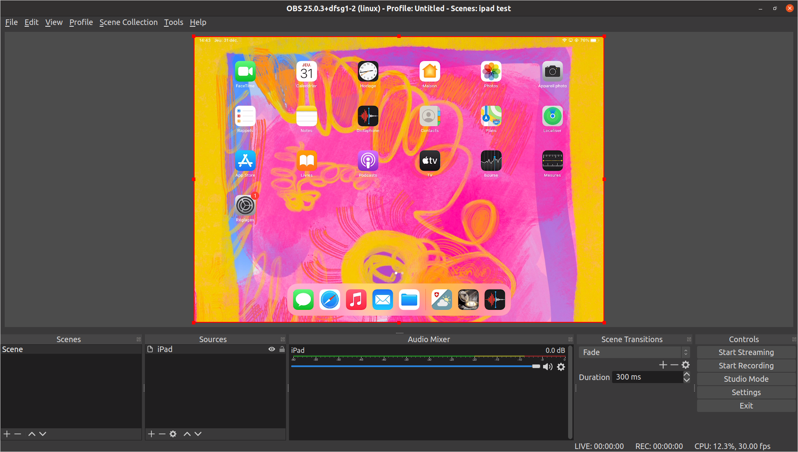

A GStreamer plugin that provides an `airplaysrc` element for receiving video
streamed from Apple devices using the AirPlay protocol. Audio is currently not
supported.

Here's a screenshot showing the iPad screen in OBS Studio:



## Installation

See [below](#building) for build instructions. Once you have the file `libgstairplay.so`,
you must let GStreamer find it. You can do one of the following:

* place the `libgstairplay.so` file in `~/.local/share/gstreamer-1.0/plugins` (create this `plugins` directory if it doesn't exist already), or
* use the `--gst-plugin-path` option with `gst-launch` (for example `gst-launch-1.0 --gst-plugin-path=~/my-gst-plugins airplaysrc ! ...`, see below for examples of complete pipelines), or
* add the directory containing the plugin to the `GST_PLUGIN_PATH` environment variable.

## Usage

The `airplaysrc` element can be used like other video sources in GStreamer
pipelines. Examples are shown below.

Typical use will require the following packages (tested on Ubuntu 20.04):

```
gstreamer1.0-tools
gstreamer1.0-plugins-good
gstreamer1.0-plugins-bad
gstreamer1.0-libav
libavahi-compat-libdnssd1
libplist3
```

To stream the video from an iPad, once you have a GStreamer pipeline running,
select "Screen Mirroring" in the iPad control center. You should see
"gstairplay" as a mirroring destination. Select it, and the streaming should
start after a few seconds.

### Showing the video in a window

The `gst-launch` tool can be used to run a pipeline that shows the video stream
in a new window:

```
gst-launch-1.0 airplaysrc ! queue ! h264parse ! avdec_h264 max-threads=1 ! autovideosink
```

Explanation: the video stream is received in the H.264 format. The stream must
be parsed (`h264parse`) and decoded (`avdec_h264`) before showing in a window
(`autovideosink`). The `queue` element adds some buffering. The `max-threads=1`
decoding option can help reduce latency.

### Using as a source in OBS Studio

The `airplaysrc` element can be used with the [OBS GStreamer
plugin](https://github.com/fzwoch/obs-gstreamer) to configure an OBS source
that shows the AirPlay video stream:

1. Install the OBS Gstreamer plugin. After compiling, I put the file `obs-gstreamer.so` in the directory `~/.config/obs-studio/plugins/obs-gstreamer/bin/64bit/`.
1. In your OBS scene, add a "GStreamer Source"
1. Set the pipeline parameter, using `airplaysrc` as first element. I use the following:

       airplaysrc ! queue ! h264parse ! avdec_h264 max-threads=1 ! videoconvert ! videoscale ! video.

1. For best results, set the canvas and output sizes to the resolution of the AirPlay stream.

### Using as a Linux camera device

Using the [v4l2loopback](https://github.com/umlaeute/v4l2loopback) kernel
module, you can expose the AirPlay video stream as a camera device in Linux.

1. Install the `v4l2loopback` module. Your distribution might have it as a package, for example `v4l2loopback-dkms` in Ubuntu 20.04.
1. Load the module with appropriate options. I use the following:

       sudo modprobe v4l2loopback devices=1 video_nr=10 card_label="AirPlay Cam" exclusive_caps=1 max_buffers=3

   This creates a virtual camera with name "AirPlay Cam" and device `/dev/video10`.

1. Start a GStreamer pipeline that feeds the AirPlay stream to the video device:

       gst-launch-1.0 -v airplaysrc ! queue ! h264parse ! avdec_h264 max-threads=1 ! videoconvert ! videoscale ! v4l2sink device=/dev/video10

Once you start streaming from the Apple device, you should see "AirPlay Cam" in the list of cameras on your computer.

## Troubleshooting

Call `gst-inspect-1.0 libgstairplay.so` (giving the path where the
`libgstairplay.so` file is located) to check for problems such as missing
libraries. For example if it says `libplist.so.3: cannot open shared object
file: No such file or directory`, you can fix it by installing the `libplist3`
package (on Ubuntu 20.04 at least).

If you get an uninformative error message such as `Could not load plugin file:
File "libgstairplay.so" appears to be a GStreamer plugin, but it failed to
initialize`, try running again with `GST_DEBUG=4 gst-inspect-1.0
build/libgstairplay.so`.

## Building

First install the build dependencies. The following packages are needed on
Ubuntu 20.04:

```
git
gcc
pkg-config
cmake
gstreamer1.0-tools
libgstreamer1.0-dev
libgstreamer-plugins-base1.0-dev
libavahi-compat-libdnssd-dev
libplist-dev
libssl-dev
meson
ninja-build
```

Then clone and build this project. I use the following:

```
git clone https://github.com/knuesel/gst-airplay
cd gst-airplay
meson build
ninja -C build
```

You should now have the compiled plugin `libgstairplay.so` in the `build`
directory. To check that it is a valid GStreamer plugin, run:

```
gst-inspect-1.0 build/libgstairplay.so 
```

This should display something such as

```
Plugin Details:
  Name                     airplay
  Description              receive video through Apple AirPlay
  Filename                 build/libgstairplay.so
  Version                  0.1
  License                  GPL
  Source module            gst-airplay-plugin
  Binary package           GStreamer airplay Plug-ins
  Origin URL               https://github.com/knuesel/gst-airplay

  airplaysrc: AirPlay source

  1 features:
  +-- 1 elements
```

If you get an error message, see the [Troubleshooting](#troubleshooting) section.

If you have a valid plugin, you can proceed to install it (see the
[Installation](#installation) section at the top of this page).

## Credits

The pluging code is based on
[gst-template](https://gitlab.freedesktop.org/gstreamer/gst-template/) and uses
the AirPlay implementation from [RPiPlay](https://github.com/FD-/RPiPlay) with
some changes (published in [this fork](https://github.com/knuesel/RPiPlay)).

## License

The plugin makes use of [RPiPlay](https://github.com/FD-/RPiPlay) so it is
licensed under the GNU GPL 3.0.
